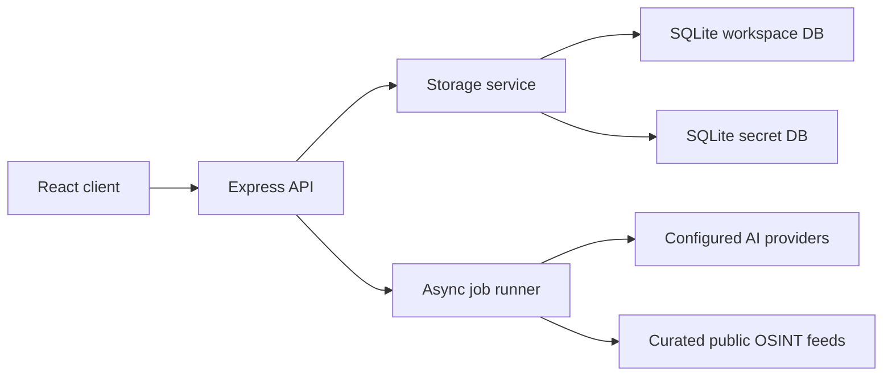

# OptraSight BatchOne Architecture

OptraSight BatchOne is a single-process threat-intel workstation for release review and defensive use. It combines OSINT intake, actor dossiers, AI provider setup, job control, and platform user administration in one Express + React application backed by SQLite.

This document is public-facing. It describes only the BatchOne release surface.

## Runtime Shape



- The client is a Vite React app using hash routing.
- The server is Express 5 with synchronous `better-sqlite3` access through Drizzle and focused raw SQL where analytics need it.
- API keys live in a separate secret database under `data/secrets/`; public CTI/TAP data stays separate from secrets.
- Long AI operations use the async job pattern. Chat-style converse remains synchronous.

## BatchOne Surfaces

| Surface | Route | Purpose |
|---|---|---|
| Login and account security | `/#/` | Credentialed sign-in, temporary-password rotation, MFA enrollment |
| Intel Inbox | `/#/osint` | Source review, finding triage, hunting-query review, CIRT-style analysis |
| Actor Observatory | `/#/threat-actors` | Threat actor profile cards, detail dossiers, portrait handling |
| AI Setup | `/#/ai-setup` | Provider key storage, provider status, BatchOne task routing |
| Job Control | `/#/operations-audit` | AI/background job state, diagnostics, audit history |
| Platform Users | `/#/platform-users` | Local BatchOne user administration |

BatchOne intentionally exposes only the routes listed above. Workflows outside this release scope should not be linked from navigation or documented as available capabilities.

## Server Modules

| File | Responsibility |
|---|---|
| `server/index.ts` | Process boot, middleware, security headers, central error funnel |
| `server/routes.ts` | BatchOne HTTP route mounting and request validation |
| `server/storage.ts` | SQLite persistence, seed data repair, query helpers, compatibility data access |
| `server/authz.ts` | Session authentication and capability checks |
| `server/secretStore.ts` | Separate encrypted secret database for provider/API keys |
| `server/osintFetcher.ts` | Curated source ingestion and finding extraction |
| `server/osintSeed.ts` | Parseable OSINT source catalog |
| `server/osintChat.ts` | CIRT triage and deep-dive async jobs |
| `server/aiClient.ts` | AI task dispatch and provider selection |
| `server/aiLive.ts` | Provider HTTP plumbing |
| `server/sourceFetch.ts` | Source URL fetching with SSRF guardrails |
| `server/tapPortrait.ts` | TAP portrait generation and upload handling |
| `server/tapDocx.ts` | TAP dossier export |
| `server/httpClient.ts` | Shared outbound HTTP wrapper |

Some schema tables and storage methods are retained for safe migration from earlier internal workspaces. They are not reachable through BatchOne navigation unless listed above.

## Client Modules

| File | Responsibility |
|---|---|
| `client/src/App.tsx` | Hash router and BatchOne route allowlist |
| `client/src/components/AppShell.tsx` | Shared sidebar/topbar chrome and account controls |
| `client/src/pages/Login.tsx` | Sign-in and account security setup entry |
| `client/src/pages/OsintMonitoring.tsx` | Intel Inbox, sources, findings, hunt-query review |
| `client/src/pages/ThreatActors.tsx` | Actor Observatory cards and TAP detail sheet |
| `client/src/pages/AISetup.tsx` | Provider configuration and task routing |
| `client/src/pages/OperationsAudit.tsx` | Job Control and audit views |
| `client/src/pages/PlatformUsers.tsx` | BatchOne user management |

Shared UI primitives live under `client/src/components/`; reusable release and access policy helpers live under `client/src/lib/`.

## Data Boundaries

| Path | Contents | Public handling |
|---|---|---|
| `data/data.db` | Runtime workspace DB | Git-ignored; inspect before sharing |
| `data/public/*.db` | Sanitized CTI/TAP exports | Shareable after export validation |
| `data/public/portraits/` | Watermarked curated TAP portraits | Shareable release assets |
| `data/secrets/*.db` | Provider/API key ciphertext | Git-ignored; never publish |
| `data/portraits/` | Generated/uploaded TAP portraits | Git-ignored unless curated for release |
| `spec/integrations.json` | BatchOne-safe metadata | Must not list capabilities outside this release scope |

## Security Model

- Sessions use bearer tokens stored server-side as hashes.
- Default seeded accounts must rotate passwords and enroll MFA before workspace functions unlock.
- Review access is read-only; admin capabilities are required for platform-user administration and privileged configuration.
- Strict mode disables mock AI fallbacks and surfaces provider/configuration errors honestly.
- Global workspace views are not part of BatchOne.
- Browser storage and cookies are not used for application state.
- Source fetching rejects unsafe internal/private network targets.

## Build And Verification

```bash
npm run lint
npm run typecheck:baseline
npm test
npm run build
```

For browser smoke testing, start the app with `npm run dev`, sign in with local seed credentials, rotate the temporary password, enroll MFA, and verify Intel Inbox, Actor Observatory, AI Setup, Job Control, and Platform Users.
