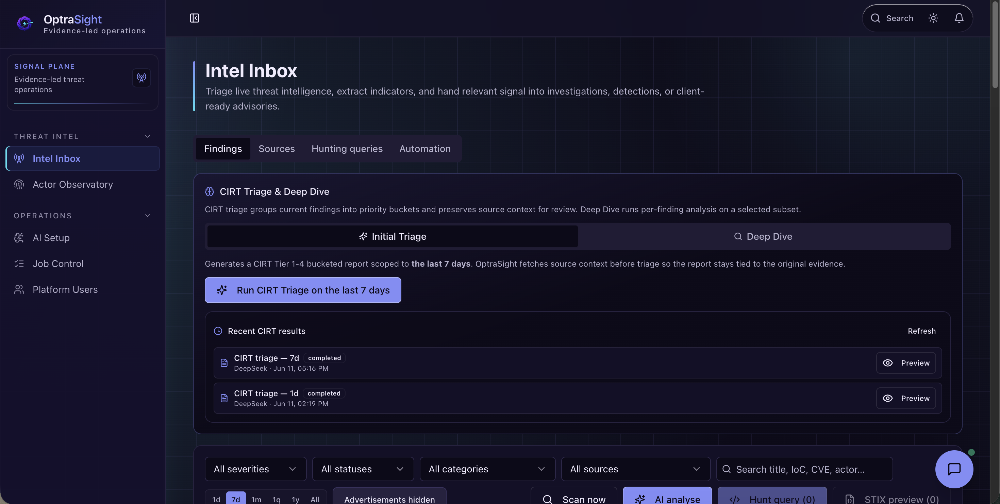
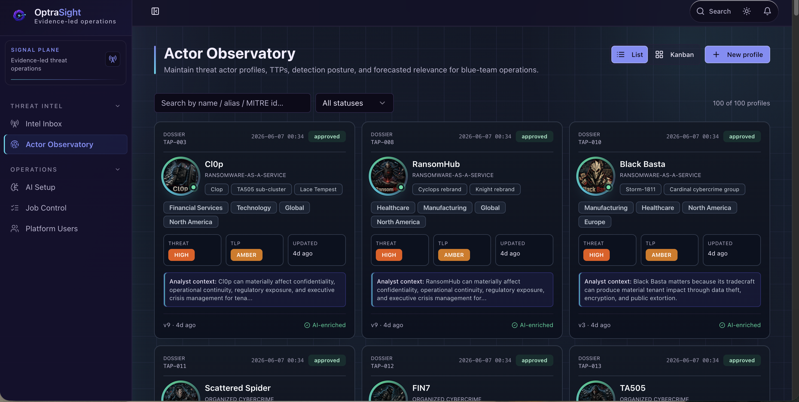
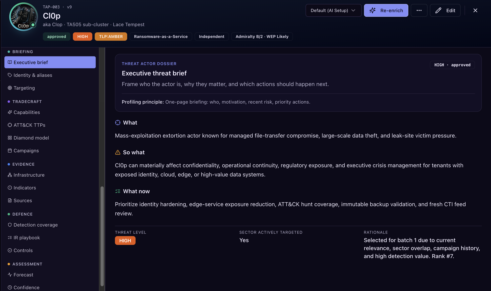
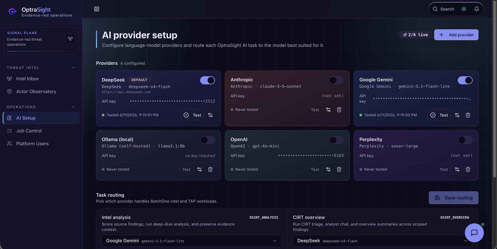

<p align="center">
  
</p>

<p align="center">Open-source cyber threat intelligence workstation for OSINT triage, threat actor profiles, AI-assisted analysis, and hunt-query generation.</p>

<p align="center">
  <a href="LICENSE"></a>
  
  
</p>

OptraSight Batch One is an open-source cyber threat intelligence (CTI) workstation for security analysts, threat-intelligence teams, detection engineers, and managed security service providers. It connects open-source intelligence (OSINT) monitoring, evidence review, threat actor profiles, AI-assisted triage, and defensive hunt-query drafting in one local analyst workspace.

The core workflow is simple: collect public threat signals, review the evidence, enrich actor context, draft hunt logic for SIEM and detection platforms, and keep source traceability visible from intake to action.

Before running a downloaded release archive, verify its checksum and signature with [VERIFYING.md](./VERIFYING.md).

This release is deliberately focused: a clean, inspectable workstation for open-source intelligence review and threat-actor analysis. It is built to be useful on day one, while leaving the product room to grow through future public releases.

## Promo Video

Watch the Batch One workflow from OSINT signal to Threat Actor Profile, hunt-query draft, and analyst action.

<video src="client/public/promo/optrasight-batch-one-promo.mp4" controls muted playsinline width="720">
  Watch the Batch One promo video.
</video>

[Watch the Batch One promo video](client/public/promo/optrasight-batch-one-promo.mp4)

## Product Screenshots

| Intel Inbox | Threat Actor Profiles |
| --- | --- |
|  |  |

| Threat Actor Profile Detail | AI Setup |
| --- | --- |
|  |  |

## Repository Summary

| Field | Details |
| --- | --- |
| Product category | Open-source CTI workstation, OSINT triage tool, threat actor profile manager, AI-assisted threat-intelligence workspace |
| Primary users | SOC analysts, CTI analysts, detection engineers, incident-response teams, MSSP analysts, security researchers |
| Core workflow | OSINT finding -> evidence review -> actor context -> hunt-query draft -> analyst action |
| AI posture | Bring your own provider key; strict mode surfaces real provider errors instead of mock output |
| Data posture | Public seed data ships in git; runtime databases, API keys, uploaded portraits, and secrets stay local |
| Deployment model | Local Express + React app backed by SQLite |

OptraSight is relevant if you are searching for:

- an open-source threat intelligence platform for OSINT triage;
- a cyber threat intelligence tool for threat actor profiles and actor dossiers;
- an AI-assisted SOC analyst workstation that keeps evidence traceability visible;
- a hunt-query generator for Splunk SPL, Elastic KQL, Microsoft Sentinel KQL, Google Chronicle YARA-L, Palo Alto Cortex XQL, Sigma, and YARA;
- a local-first security operations tool for evaluating public threat reports, indicators, tactics, techniques, procedures, and analyst notes.

## Use Cases

- Triage public OSINT findings with source context, severity, ATT&CK scope, affected technology, and analyst notes in one workflow.
- Maintain Threat Actor Profiles with aliases, campaigns, indicators, tactics, techniques, procedures, confidence drivers, evidence references, and dossier exports.
- Use configured AI providers to assist with finding analysis, CIRT-style triage, deep-dive review, actor enrichment, and hunt-query drafting.
- Draft defensive hunt logic for Splunk SPL, Elastic KQL, Microsoft Sentinel KQL, Google Chronicle YARA-L, Palo Alto Cortex XQL, Sigma, and YARA.
- Evaluate a local-first CTI workstation with sanitized public seed data, watermarked actor portraits, no bundled secrets, and strict provider error handling.

## Key Capabilities

Batch One focuses on the analyst workflow from signal intake to defense-ready output:

- **Intel Inbox** for parsed OSINT findings, source review, AI triage, CIRT-style deep dive, and finding-level analysis.
- **Actor Observatory** for Threat Actor Profiles, actor aliases, TTPs, IOCs, campaigns, evidence, portraits, and exports.
- **Hunting queries** generated from selected intelligence for defensive validation across common SIEM and detection languages.
- **AI Setup** for your own DeepSeek, OpenAI, Anthropic, or Google Gemini provider keys.
- **Job Control** for background AI and ingestion work.
- **Platform Users** for local admin and reviewer accounts.

## Release Scope

Batch One is intentionally focused on the analyst workstation experience: Intel Inbox, Actor Observatory, Threat Actor Profiles, Hunting Queries, AI Setup, Job Control, and local platform access controls. It is designed to be useful as a public open-source release while keeping the operating surface clear, inspectable, and easy to run locally.

Some broader platform capabilities are outside this public release. Rather than exposing every internal module or future direction, this repository keeps the Batch One boundary simple: threat-intelligence intake, actor analysis, and evidence-led hunting workflows.

Follow the repository for future public releases as the project expands its evidence-led security operations workflows.

## Quick Start

### 1. Clone and install

```bash
git clone https://github.com/<org>/optrasight.git
cd optrasight
npm install
```

### 2. Restore the public BatchOne dataset

```bash
npm run db:restore-public
```

This creates a local git-ignored `data.db` from the sanitized public release assets:

```text
data/public/optrasight-threat-intel-public.db
data/public/optrasight-threat-actors-public.db
data/public/portraits/
```

The restore step copies public threat-intel findings, Threat Actor Profiles, and watermarked Threat Actor Profile portraits into local runtime paths. It does **not** restore API keys or private secrets.

If you intentionally want to rebuild an existing local runtime database:

```bash
npm run db:restore-public -- --force
```

### 3. Start the platform

```bash
npm run dev
```

Open:

```text
http://localhost:5000
```

### 4. Sign in with a local seed account

These credentials are public knowledge and exist only for local first-run access. Rotate, disable, or delete them before using OptraSight with real data.

| Role | Email | Temporary password |
| --- | --- | --- |
| Platform admin | `admin@cep.com` | `ChangeMe!2026Admin` |
| Read-only reviewer | `reviewer@cep.com` | `ChangeMe!2026Review` |

Seed accounts must change the temporary password and enroll MFA before platform functions unlock.

### 5. Add your AI provider key

Open `/#/ai-setup` and add your own AI provider key. OptraSight supports live routing for DeepSeek, OpenAI, Anthropic, and Google Gemini.

AI provider keys are stored separately from public seed data. They are not bundled with the repository and are not restored from the public seed data. When strict mode is enabled, unavailable or misconfigured providers return real setup errors instead of silent mock output.

## What Ships In Git

The public repository is designed to be cloned without private runtime state.

Tracked public seed assets:

```text
data/public/optrasight-threat-intel-public.db
data/public/optrasight-threat-actors-public.db
data/public/portraits/
```

Local-only runtime and secret paths stay git-ignored:

```text
data.db
data/data.db
data/secrets/
data/private/
data/portraits/
.env
dist/
node_modules/
```

In practical terms: a fresh GitHub clone will not look exactly like the maintainer machine until the user runs `npm run db:restore-public` and adds their own AI keys.

## Core Workflows

### Intel Inbox

Review parsed OSINT findings, filter advertisements and low-actionability items, inspect source and ingestion timestamps, run AI analysis on individual findings, and queue CIRT triage or deep-dive jobs.

### Actor Observatory

Inspect and maintain Threat Actor Profiles with aliases, sector and region targeting, TTPs, IOCs, campaigns, confidence drivers, evidence references, portraits, and exportable dossiers.

### Hunting Queries

Generate defensive hunt queries from selected intelligence. The goal is practical validation content that remains linked to source findings and actor context.

### Analyst Chat

Use the floating analyst chat for general security questions, threat-intel reasoning, Threat Actor Profile context, hunt-query guidance, or source URL review. When a URL is supplied, the server fetches source context before asking the configured AI provider to analyze it.

## Security Model

- **Authorized use only:** use OptraSight only for defensive security work on systems, data, and sources you are allowed to assess.
- **Strict mode:** production blocks silent mock fallbacks and surfaces provider/configuration errors.
- **No bundled secrets:** AI keys and secret databases are not committed.
- **No durable browser storage:** the app avoids localStorage, sessionStorage, IndexedDB, cookies, and URL tokens for session/application state.
- **Server-side session expiry:** bearer sessions are validated against the server database.

Default session lifetimes:

| Account type | Idle timeout | Absolute timeout |
| --- | ---: | ---: |
| Platform admin | 1 hour | 12 hours |
| Read-only reviewer / non-admin | 12 hours | 24 hours |

Override with:

```text
OPTRASIGHT_ADMIN_SESSION_IDLE_MS
OPTRASIGHT_ADMIN_SESSION_ABSOLUTE_MS
OPTRASIGHT_SESSION_IDLE_MS
OPTRASIGHT_SESSION_ABSOLUTE_MS
```

Report security issues through the process in [SECURITY.md](./SECURITY.md). Please do not file public issues for vulnerabilities.

## Scripts

```bash
npm run dev                # start local Express + Vite development server
npm run build              # build production client/server bundle
npm start                  # run the built server
npm run db:restore-public  # create local data.db from public BatchOne seed assets
npm run setup:batchone     # compatibility alias for the same restore workflow
npm run db:export-public   # export sanitized public seed DBs from a populated workspace
npm run lint               # ESLint
npm test                   # Vitest
npm run typecheck          # full TypeScript check
npm run check              # lint + tests + typecheck baseline gate
```

## Requirements

- Node.js 20+; CI targets Node 20.x and 22.x.
- npm 9+.
- SQLite-compatible local filesystem.
## Production Build

```bash
npm run build
NODE_ENV=production npm start
```

or:

```bash
NODE_ENV=production node dist/index.cjs
```

When `NODE_ENV=production`, strict mode is enabled by default. Missing AI providers or blocked mock fallbacks return explicit errors rather than synthetic results.

## Environment Variables

| Variable | Default | Purpose |
| --- | --- | --- |
| `NODE_ENV` | `development` | Switches development/production behavior. |
| `PORT` | `5000` | HTTP listen port. |
| `OPTRASIGHT_STRICT` | `1` in production | Blocks mock fallback paths and surfaces real missing-provider/upstream errors. |
| `OPTRASIGHT_AI_LIVE` | `1` | Emergency live-AI kill switch for offline development. |
| `OPTRASIGHT_ADMIN_SESSION_IDLE_MS` | `3600000` | Admin idle session timeout. |
| `OPTRASIGHT_ADMIN_SESSION_ABSOLUTE_MS` | `43200000` | Admin absolute session lifetime. |
| `OPTRASIGHT_SESSION_IDLE_MS` | `43200000` | Reviewer/non-admin idle session timeout. |
| `OPTRASIGHT_SESSION_ABSOLUTE_MS` | `86400000` | Reviewer/non-admin absolute session lifetime. |

## Repository Map

```text
client/                 React, Vite, Tailwind, shadcn/Radix UI
server/                 Express API, SQLite storage, AI dispatch, OSINT ingestion
shared/                 Shared schema, DTOs, validation, access policy
data/public/            Sanitized public BatchOne seed DBs and portraits
scripts/                Public DB restore/export and release safety helpers
spec/                   API and connector metadata snapshots
tests/                  Security and regression tests
```

## Contributing

Read [CONTRIBUTING.md](./CONTRIBUTING.md) before opening a pull request.

Useful guardrails:

- Keep BatchOne scoped to Intel Inbox, Actor Observatory, AI Setup, Job Control, Platform Users, and supporting APIs.
- Do not expand the release surface without an explicit BatchOne scope decision.
- Use `apiRequest` on the client rather than raw `fetch`.
- Keep long AI work asynchronous and visible in Job Control.
- Do not commit runtime databases, secret stores, generated screenshots, logs, or uploaded private portraits.

## Further Reading

- [ARCHITECTURE.md](./ARCHITECTURE.md) - system architecture and refactor notes.
- [SECURITY.md](./SECURITY.md) - security model, secret handling, and responsible disclosure.
- [DEPLOYMENT.md](./DEPLOYMENT.md) - deployment guidance.
- [data/README.md](./data/README.md) - public seed data and restore notes.
- [CONTRIBUTORS.md](./CONTRIBUTORS.md) - maintainer and AI-assisted contribution credits.

## License

Apache License 2.0. See [LICENSE](./LICENSE) and [NOTICE](./NOTICE).

<p align="left">
  <a href="https://chillethicalpeople.com">
    
  </a>
  <br>
  <sub>Maintained by Kensho under Chill Ethical People · contact@chillethicalpeople.com</sub>
</p>
