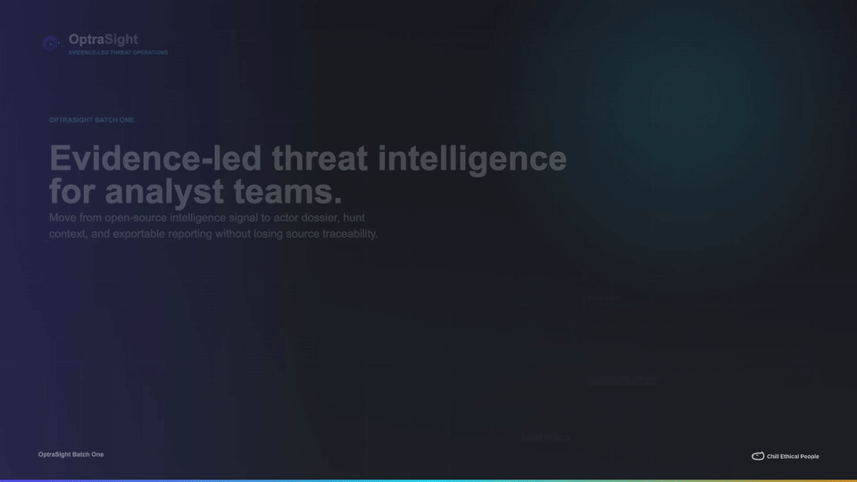
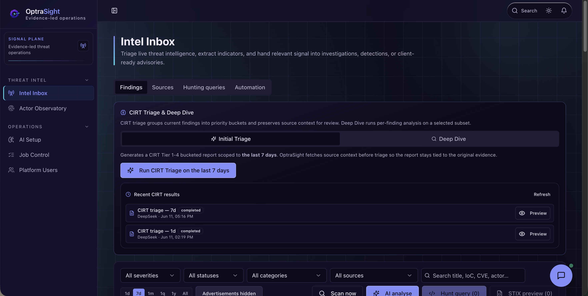
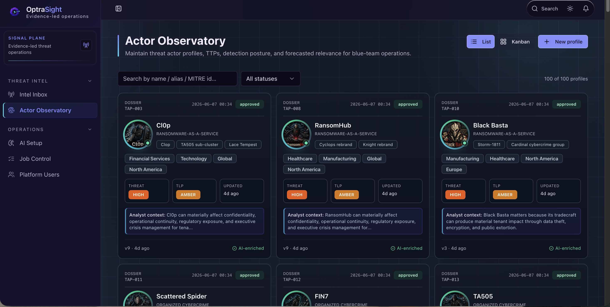
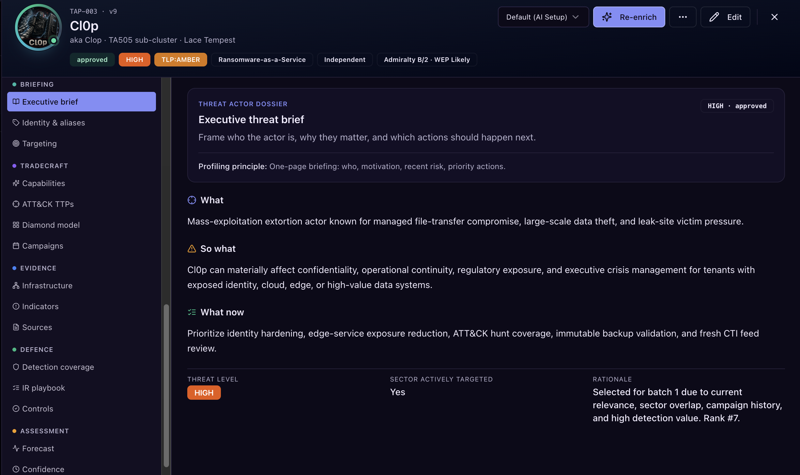
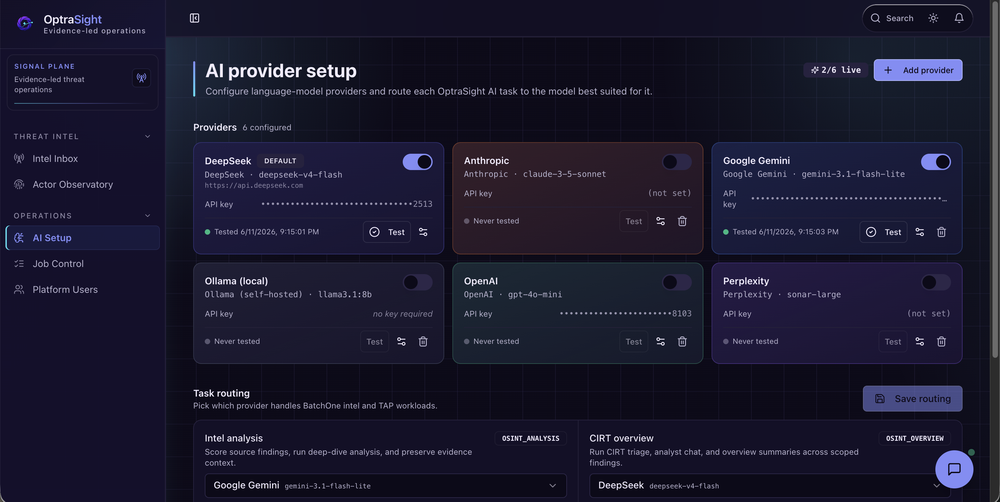

<p align="center">
  
</p>

<p align="center">Open-source cyber threat intelligence workstation for client-aware OSINT triage, Threat Actor Profiles, detection engineering, and analyst-reviewed delivery.</p>

<p align="center">
  <a href="LICENSE"></a>
  
  
  <a href="https://github.com/Chill-Ethical-People/Optrasight/actions/workflows/release.yml"></a>
  <a href="https://github.com/Chill-Ethical-People/Optrasight/actions/workflows/codeql.yml"></a>
  <a href="https://snyk.io/test/github/Chill-Ethical-People/Optrasight"></a>
</p>

> **BatchTwo beta:** this branch is intended for functional evaluation and security review. Batch One on `main` remains the stable public release.

OptraSight BatchTwo is an open-source cyber threat intelligence (CTI) workstation for security analysts, threat-intelligence teams, detection engineers, and managed security service providers. It connects open-source intelligence monitoring, evidence review, client-aware triage, Threat Actor Profiles, detection-rule management, and analyst-approved client delivery in one local workspace.

The core workflow is simple: collect public threat signals, review the evidence, enrich actor context, draft hunt logic for SIEM and detection platforms, and keep source traceability visible from intake to action.

Before running a downloaded release archive, verify its checksum and signature with [VERIFYING.md](./VERIFYING.md).

This beta extends the focused Batch One workstation with multiple Client Profiles, client-impact assessment, Client Briefs, detection-rule lifecycle management, and connector administration. AI output remains advisory: analysts control severity, client relevance, assessments, approvals, and outbound email delivery.

Static demo site: [chill-ethical-people.github.io/Optrasight](https://chill-ethical-people.github.io/Optrasight/).

## Promo Video

Watch the Batch One workflow from OSINT signal to Threat Actor Profile, hunt-query draft, and analyst action.

<p align="center">
  <a href="https://github.com/Chill-Ethical-People/Optrasight/releases/download/v0.1.0/optrasight-batch-one-promo.mp4">
    
  </a>
  <br>
  <a href="https://github.com/Chill-Ethical-People/Optrasight/releases/download/v0.1.0/optrasight-batch-one-promo.mp4">Watch the full Batch One promo video</a>
</p>

## Product Screenshots

| Intel Inbox | Threat Actor Profiles |
| --- | --- |
|  |  |

| Threat Actor Profile Detail | AI Setup |
| --- | --- |
|  |  |

## Repository Summary

| Field | Details |
| --- | --- |
| Product category | Open-source CTI workstation, client-aware OSINT triage tool, threat actor profile manager, and detection-rule workspace |
| Primary users | SOC analysts, CTI analysts, detection engineers, incident-response teams, MSSP analysts, security researchers |
| Core workflow | OSINT finding -> evidence review -> client/CIRT triage -> analyst assessment -> detection or client brief |
| AI posture | Bring your own provider key; strict mode surfaces real provider errors instead of mock output |
| Data posture | Sanitized seed data and curated portraits ship in git; runtime databases, generated portraits, API keys, and secrets stay local |
| Deployment model | Local Express + React app backed by SQLite |

OptraSight is relevant if you are searching for:

- an open-source threat intelligence platform for OSINT triage;
- a cyber threat intelligence tool for threat actor profiles and actor dossiers;
- an AI-assisted SOC analyst workstation that keeps evidence traceability and human approval visible;
- a hunt-query generator for Splunk SPL, Elastic KQL, Microsoft Sentinel KQL, Google Chronicle YARA-L, Palo Alto Cortex XQL, Sigma, and YARA;
- a local-first security operations tool for evaluating public threat reports, indicators, tactics, techniques, procedures, and analyst notes.

## Use Cases

- Triage public OSINT findings with source context, severity, ATT&CK scope, affected technology, client relevance, and analyst assessment in one workflow.
- Maintain Threat Actor Profiles with aliases, campaigns, indicators, tactics, techniques, procedures, confidence drivers, evidence references, and dossier exports.
- Use configured AI providers to assist with finding analysis, CIRT-style triage, deep-dive review, actor enrichment, and hunt-query drafting.
- Manage evidence-linked detection rules and compiled hunt logic for Splunk SPL, Elastic KQL, Microsoft Sentinel KQL, Google Chronicle YARA-L, Palo Alto Cortex XQL, Sigma, and YARA.
- Maintain multiple Client Profiles and draft severity-structured client briefs from analyst-approved intelligence.
- Evaluate a local-first CTI workstation with sanitized public seed data, watermarked actor portraits, no bundled secrets, and strict provider error handling.

## Key Capabilities

BatchTwo beta focuses on the analyst workflow from signal intake to reviewed operational output:

- **Intel Inbox** for parsed OSINT findings, source review, AI triage, CIRT-style deep dive, and finding-level analysis.
- **Actor Observatory** for Threat Actor Profiles, actor aliases, TTPs, IOCs, campaigns, evidence, portraits, and exports.
- **Detection Rules** for evidence-linked Sigma sources, compiled platform queries, validation, lifecycle review, client scope, and deployment state.
- **Client Profiles** for multiple protected organizations, canonical geography/industry/technology scope, aliases, subsidiaries, and notification settings.
- **Client Briefs** for AI-assisted candidate selection, analyst review, editable email drafts, Word/EML export, and controlled SMTP delivery.
- **Workspace Setup** for MSS mode or Individual mode; client-specific modules are hidden in Individual mode.
- **Integration Center** for AI providers, email delivery, X/FalconFeeds, KELA, and selected community enrichment connectors.
- **AI Setup** for your own DeepSeek, OpenAI, Anthropic, or Google Gemini provider keys.
- **Job Control** for background AI and ingestion work.
- **Platform Users** for local admin and reviewer accounts.

## Beta Scope

BatchTwo retains the Batch One Intel Inbox and Actor Observatory, then adds client-aware operations and detection engineering. The beta surface includes Client Profiles, Client Briefs, Detection Rules, Workspace Setup, Integration Center, Job Control, and local platform access controls.

Broader Full Platform capabilities such as attack-surface management, investigations, tabletop exercises, tenant switching, and enterprise reporting remain outside this beta unless explicitly promoted through a later release decision.

This branch is for testing, issue reporting, and design validation. Do not use beta builds as an unattended production mailer or autonomous decision system.

## Quick Start

### 1. Clone and install

```bash
git clone --branch beta-testing https://github.com/Chill-Ethical-People/Optrasight.git
cd Optrasight
npm install
```

### 2. Restore the public seed dataset

```bash
npm run db:restore-public
```

This creates a local git-ignored `data.db` from the sanitized public release assets:

```text
data/public/optrasight-threat-intel-public.db
data/public/optrasight-threat-actors-public.db
data/public/portraits/
```

The restore step copies sanitized public threat-intel findings, Threat Actor Profiles, and watermarked Threat Actor Profile portraits into local runtime paths. It does **not** restore client data, AI history, analyst assessments, API keys, email credentials, or private secrets.

If you intentionally want to rebuild an existing local runtime database:

```bash
npm run db:restore-public -- --force
```

### 3. Start the platform

```bash
npm run dev
```

Open:

```text
http://localhost:5000
```

### 4. Sign in with a local seed account

These credentials are public knowledge and exist only for local first-run access. Rotate, disable, or delete them before using OptraSight with real data.

| Role | Email | Temporary password |
| --- | --- | --- |
| Platform admin | `admin@cep.com` | `ChangeMe!2026Admin` |
| Read-only reviewer | `reviewer@cep.com` | `ChangeMe!2026Review` |

Seed accounts must change the temporary password and enroll MFA before platform functions unlock.

### 5. Add your AI provider key

Open `/#/ai-setup` and add your own AI provider key. OptraSight supports live routing for DeepSeek, OpenAI, Anthropic, and Google Gemini.

AI provider keys are stored separately from public seed data. They are not bundled with the repository and are not restored from the public seed data. When strict mode is enabled, unavailable or misconfigured providers return real setup errors instead of silent mock output.

## What Ships In Git

The public repository is designed to be cloned without private runtime state.

Tracked public seed assets:

```text
data/public/optrasight-threat-intel-public.db
data/public/optrasight-threat-actors-public.db
data/public/portraits/
```

Local-only runtime and secret paths stay git-ignored:

```text
data.db
data/data.db
data/secrets/
data/private/
data/portraits/
.env
dist/
node_modules/
```

In practical terms: a fresh GitHub clone will not look exactly like the maintainer machine until the user runs `npm run db:restore-public` and adds their own AI keys.

## Core Workflows

### Intel Inbox

Review parsed OSINT findings, filter advertisements and low-actionability items, inspect source and ingestion timestamps, run AI analysis on individual findings, and queue CIRT triage or deep-dive jobs.

### Actor Observatory

Inspect and maintain Threat Actor Profiles with aliases, sector and region targeting, TTPs, IOCs, campaigns, confidence drivers, evidence references, portraits, and exportable dossiers.

### Hunting Queries

Generate defensive hunt queries from selected intelligence and manage them in Detection Rules. The goal is practical validation content that remains linked to source findings, actor context, validation state, and deployment targets.

### Client Operations

In MSS mode, maintain multiple Client Profiles and assess intelligence against pseudonymized geography, industry, technology, alias, and subsidiary context. Analysts can review AI suggestions, change severity and relevance, edit client-ready drafts, export Word or EML, and explicitly approve delivery. Individual mode hides client-specific workflows.

### Analyst Chat

Use the floating analyst chat for general security questions, threat-intel reasoning, Threat Actor Profile context, hunt-query guidance, or source URL review. When a URL is supplied, the server fetches source context before asking the configured AI provider to analyze it.

## Security Model

- **Authorized use only:** use OptraSight only for defensive security work on systems, data, and sources you are allowed to assess.
- **Strict mode:** production blocks silent mock fallbacks and surfaces provider/configuration errors.
- **No bundled secrets:** AI keys and secret databases are not committed.
- **Human approval:** AI-selected client relevance, assessments, rules, and email drafts remain subject to analyst review.
- **Upload boundary:** browser-supplied threat-actor portraits are disabled; client logos pass through validated, rate-limited, server-keyed storage.
- **No durable browser storage:** the app avoids localStorage, sessionStorage, IndexedDB, cookies, and URL tokens for session/application state.
- **Server-side session expiry:** bearer sessions are validated against the server database.

Default session lifetimes:

| Account type | Idle timeout | Absolute timeout |
| --- | ---: | ---: |
| Platform admin | 1 hour | 12 hours |
| Read-only reviewer / non-admin | 12 hours | 24 hours |

Override with:

```text
OPTRASIGHT_ADMIN_SESSION_IDLE_MS
OPTRASIGHT_ADMIN_SESSION_ABSOLUTE_MS
OPTRASIGHT_SESSION_IDLE_MS
OPTRASIGHT_SESSION_ABSOLUTE_MS
```

Report security issues through the process in [SECURITY.md](./SECURITY.md). Please do not file public issues for vulnerabilities.

## Scripts

```bash
npm run dev                # start local Express + Vite development server
npm run build              # build production client/server bundle
npm start                  # run the built server
npm run db:restore-public  # create local data.db from sanitized public seed assets
npm run setup:batchone     # compatibility alias for the same restore workflow
npm run db:export-public   # export sanitized public seed DBs from a populated workspace
npm run lint               # ESLint
npm test                   # Vitest
npm run typecheck          # full TypeScript check
npm run check              # formatting baseline + zero-warning lint + tests + typecheck baseline
npm run security:snyk      # authenticated Snyk dependency scan
```

## Requirements

- Node.js 20.x or 22.x (the repository pins Node 22 through `.nvmrc`; Node 25 is not supported for local native-module builds).
- npm 9+.
- SQLite-compatible local filesystem.

## Production Build

```bash
npm run build
NODE_ENV=production npm start
```

or:

```bash
NODE_ENV=production node dist/index.cjs
```

When `NODE_ENV=production`, strict mode is enabled by default. Missing AI providers or blocked mock fallbacks return explicit errors rather than synthetic results.

## Environment Variables

| Variable | Default | Purpose |
| --- | --- | --- |
| `NODE_ENV` | `development` | Switches development/production behavior. |
| `PORT` | `5000` | HTTP listen port. |
| `OPTRASIGHT_STRICT` | `1` in production | Blocks mock fallback paths and surfaces real missing-provider/upstream errors. |
| `OPTRASIGHT_AI_LIVE` | `1` | Emergency live-AI kill switch for offline development. |
| `X_BEARER_TOKEN` | unset | Optional X API v2 bearer token for authenticated FalconFeeds.io ransomware-alert ingestion. |
| `OPTRASIGHT_ADMIN_SESSION_IDLE_MS` | `3600000` | Admin idle session timeout. |
| `OPTRASIGHT_ADMIN_SESSION_ABSOLUTE_MS` | `43200000` | Admin absolute session lifetime. |
| `OPTRASIGHT_SESSION_IDLE_MS` | `43200000` | Reviewer/non-admin idle session timeout. |
| `OPTRASIGHT_SESSION_ABSOLUTE_MS` | `86400000` | Reviewer/non-admin absolute session lifetime. |

## Repository Map

```text
client/                 React, Vite, Tailwind, shadcn/Radix UI
server/                 Express API, SQLite storage, AI dispatch, OSINT ingestion
shared/                 Shared schema, DTOs, validation, access policy
data/public/            Sanitized public seed DBs and portraits used by BatchTwo beta
scripts/                Public DB restore/export and release safety helpers
spec/                   API and connector metadata snapshots
tests/                  Security and regression tests
```

## Contributing

Read [CONTRIBUTING.md](./CONTRIBUTING.md) before opening a pull request.

Useful guardrails:

- Keep BatchTwo beta scoped to the modules documented above.
- Do not reintroduce Full Platform modules without an explicit release decision.
- Use `apiRequest` on the client rather than raw `fetch`.
- Keep long AI work asynchronous and visible in Job Control.
- Do not commit runtime databases, secret stores, generated screenshots, logs, or uploaded private portraits.

## Further Reading

- [ARCHITECTURE.md](./ARCHITECTURE.md) - system architecture and refactor notes.
- [SECURITY.md](./SECURITY.md) - security model, secret handling, and responsible disclosure.
- [DEPLOYMENT.md](./DEPLOYMENT.md) - deployment guidance.
- [data/README.md](./data/README.md) - public seed data and restore notes.
- [CONTRIBUTORS.md](./CONTRIBUTORS.md) - maintainer and AI-assisted contribution credits.

## Contributors

OptraSight includes AI-assisted implementation, review, and documentation support from **OpenAI Codex** and **Anthropic Claude**.

See [CONTRIBUTORS.md](./CONTRIBUTORS.md) for the full contributor note.

## License

Apache License 2.0. See [LICENSE](./LICENSE) and [NOTICE](./NOTICE).

<p align="left">
  <a href="https://chillethicalpeople.com">
    
  </a>
  <br>
  <sub>Maintained by Kensho under Chill Ethical People · contact@chillethicalpeople.com</sub>
</p>
