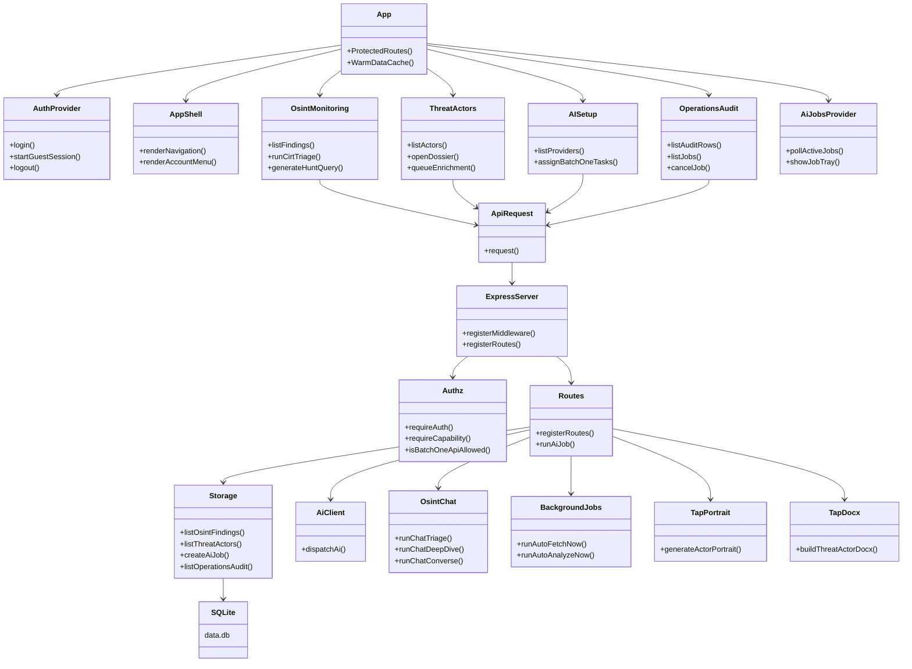
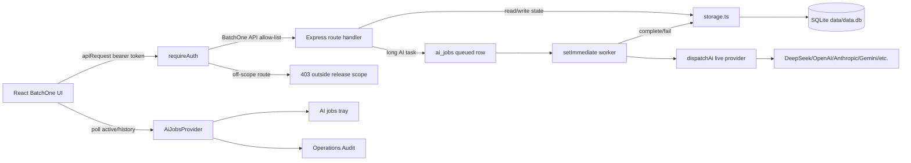

# BatchOne Code Graph

This note maps the active BatchOne release surface after the route and module cleanup. It is intentionally implementation-focused so the next engineer can pick up the code without rediscovering the release boundary.

## Release Boundary

BatchOne exposes Intel Inbox, Actor Observatory/TAP, AI Setup, and Operations Audit/Job Control. The client route list is in `client/src/App.tsx`, and the server API allow-list is in `shared/accessPolicy.ts`.

Some compatibility schema and storage fields remain because bundled SQLite workspaces may still carry older table shapes. In BatchOne, capabilities outside the release scope are not linked from navigation and are blocked by the API allow-list before route handlers run.

## Class Diagram

## Request And Job Flow

## Active Modules

- `client/src/App.tsx`: BatchOne route allow-list and cache warming.
- `client/src/pages/OsintMonitoring.tsx`: Intel Inbox, sources, CIRT triage, hunt queries.
- `client/src/pages/ThreatActors.tsx`: Actor Observatory/TAP list and dossier detail.
- `client/src/pages/AISetup.tsx`: provider setup for the explicit BatchOne AI task set.
- `client/src/pages/OperationsAudit.tsx`: audit rows and job control.
- `server/authz.ts` and `shared/accessPolicy.ts`: role/capability resolution and API boundary.
- `server/routes.ts`: HTTP handlers, including retained compatibility handlers that are blocked for BatchOne when off-scope.
- `server/storage.ts`: SQLite persistence and compatibility migrations.
- `server/secretStore.ts`: separate SQLite secret store for encrypted API-provider and connector credentials.

## Removed From BatchOne Surface

- Full-platform client pages for ASM, investigations, reports, settings, integrations, detection-rule workspace, tabletop exercises, and malicious-site scanner were removed from active client modules.
- Tabletop exercise server generation modules and public exercise portal routes were removed from the BatchOne server.
- `pptxgenjs` was removed because BatchOne no longer ships the tabletop PPTX export path.

## Human Pickup Notes

- Do not remove shared schema columns solely because the BatchOne UI no longer renders them. Existing bundled databases may still need idempotent migration compatibility.
- Keep API-provider and connector ciphertext out of the workspace DB. Secret material belongs in `data/secrets/optrasight-secrets.db`; public OSINT/TAP exports should only contain metadata and masks.
- Keep `client/src/App.tsx` and `shared/accessPolicy.ts` aligned whenever a BatchOne route is added or removed.
- Add new long-running AI work through the existing async-job pattern unless it is the synchronous chat/converse path.
- Prefer extracting from `server/routes.ts` and `server/storage.ts` incrementally; they remain the largest architectural hubs.
- Code-review graph currently reports high coupling between UI shell/sidebar code and AI/job libraries. Treat that as the next modularity target, but verify React callbacks and shadcn/ui exports manually before deleting anything flagged as dead code.
